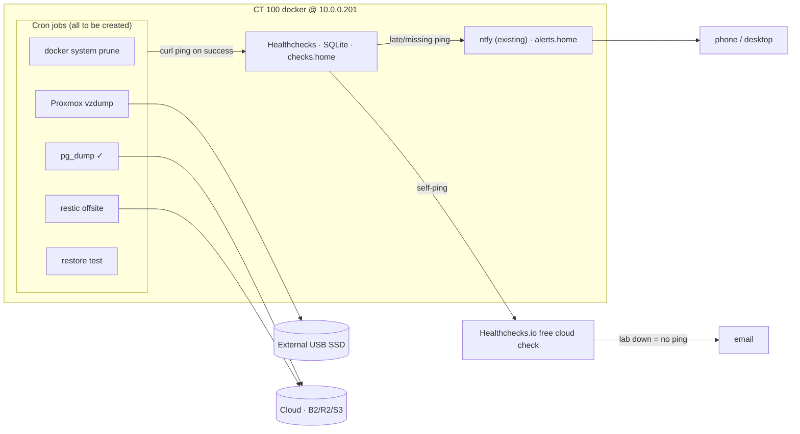

# TSD — Backups, restore testing & job monitoring

**Status:** ⏸ parked / blocked (2026-06-08) — no backup-target hardware yet
**Goal:** Give the lab real, recoverable backups (it currently has **none**), then a dead-man's-switch monitor for the backup/maintenance jobs and an automated restore test that proves backups are *restorable* — not merely that they ran.

> Moved from `ideas/proposals/` on 2026-06-08 — homelab-specific specs live with the implementation. `ideas/` is reserved for greenfield products/apps/businesses.

## Current state (audited 2026-06-07)
Swept both hosts (Proxmox `m5` @ 10.0.0.200, docker LXC @ 10.0.0.201): **no user-created scheduled jobs** — `no crontab for root` on both, empty `/etc/pve/vzdump.cron` + `jobs.cfg` (the `vzdump` cron symlink is Proxmox's default empty stub), only default OS/Proxmox timers. The one data-integrity job is the default **monthly ZFS scrub** (`zfsutils-linux`, host on ZFS rpool).

**The lab has zero backups** — no vzdump, no `pg_dump`, no offsite. A CT/VM or Postgres loss today is unrecoverable. So this spec is **create backups first, then monitor** — monitoring a job that doesn't exist is meaningless.

### Footprint (measured)
- CT 100 used: **42 GB** (mostly re-pullable Docker images).
- Irreplaceable data (volumes): **~3.4 GB** — biggest are `ai_open_webui_data` (1.1 G) and `ai_ollama_data` (1.9 G). Ollama *models* are tiny here (~1.9 G in-volume; `models/` dir is just Modelfiles).
- Shared Postgres `homelab` DB is currently **empty** (~4 KB dump; same size as the empty `postgres` DB).

### Stopgaps already done (2026-06-08 — zero-cost, same-disk only)
- [x] All live LXC configs committed + pushed to this repo (drift check caught 6 untracked Grafana dashboards). GitHub = free offsite for the reproducible layer.
- [x] Nightly `pg_dumpall` — [`scripts/pg-backup.sh`](../../scripts/pg-backup.sh), cron 02:00, 14-day retention, `/opt/backups/postgres`, `umask 077` (dumps contain SCRAM role password hashes). Survives accidental `DROP`/corruption — **not** disk failure.

## Why this matters
Detection ≠ prevention. The #1 cause of homelab data loss is a backup that ran fine but couldn't be restored. The layers: **create → verify it restores → monitor that it runs.** A monitored-but-never-tested backup gives false confidence.

## Approach
- **Local image** — Proxmox `vzdump` of CT 100 → external USB SSD. Built-in, GUI-scheduled (Datacenter → Backup), zstd-compressed. One-shot full-CT restore.
- **Offsite data** — `restic` → cloud (B2 preferred). Encrypted client-side, deduplicated; `restic check` doubles as the verification layer. Backs up `pg_dump` output + data volumes only.
- **Postgres** — the existing nightly `pg_dumpall` feeds both.
- **Monitoring** — self-hosted **Healthchecks** (SQLite, new `checks.home`) for heartbeats; **alert via the already-deployed ntfy** (`alerts.home`). Each job pings on success; Healthchecks alerts on a late/missing ping.

> **Found on colocation:** ntfy and blackbox-exporter are **already deployed** in `docker/monitoring/`. So alerting reuses existing ntfy (`alerts.home`) — only Healthchecks is net-new. blackbox-exporter already covers uptime/cert-style checks, so those stay in Prometheus/Grafana, **not** heartbeats. (This correction came directly from having the spec next to the code.)

## Architecture

## Jobs (rollout order — none exist yet)
| # | Job | Severity | New? | Notes |
|---|-----|----------|------|-------|
| 1 | `docker system prune -f` (weekly) | ⚪ Low | create | Warm-up — proves the pipeline |
| 2 | Proxmox `vzdump` (CT backup) | 🔴 Critical | create | The catastrophe case — lab has none |
| 3 | PostgreSQL `pg_dumpall` | 🔴 Critical | ✅ done | Already deployed as a stopgap |
| 4 | restic/rclone offsite sync | 🔴 Critical | create | 3-2-1 — a local-only backup isn't a backup |
| 5 | Restore test (weekly) | ♻️ Recovery | create | Proves backups are restorable |
| — | ZFS scrub (monthly) | 🟡 Med | exists | Default `zfsutils-linux` job — easy later heartbeat target |

## Restore test (tiered — resolved)
- **Weekly, automated:** archive integrity (`zstd -t`) + Postgres logical restore into a scratch DB with a sanity query, then drop.
- **Quarterly, manual:** full CT boot-restore to **alternate storage** — never the same thin pool. (`pve/data` is ~348 GiB with a non-extendable 400 GiB thin rootfs; a full restore there could fill the pool and take the lab down.)

## Cost & footprint
- Healthchecks (~150–250 MB; ntfy already running) — ~$0, well within headroom (RAM ~45% used, CPU ~2%).
- USB SSD — **~$50 one-time** (500 GB plenty for ~3.4 GB data; 1 TB if the price gap is trivial). No recurring cost.
- Cloud offsite — **~$1/mo** (B2) for this data size. Optional; S3 Glacier cheapest-but-clunky.

## Unblock criteria
1. **Attach a ~$50 external USB SSD** → enables vzdump + local restic, real disk-failure protection. **Primary unblock.**
2. *(Optional)* decide to pay ~$1/mo for cloud offsite (B2 preferred) → off-premises copy for fire/theft.

## Decisions log
- Backup approach: **both** image (vzdump) + data (restic). Exclude re-pullable bits where it saves space.
- Alerting: **ntfy only**, reusing the deployed `alerts.home`.
- Watcher-of-the-watcher: one free Healthchecks.io cloud check receiving a self-ping (the only off-box piece).
- Restore-test cadence: weekly (automated tiers A+B); quarterly manual tier C.
- Offsite must be encrypted (restic native) — dumps contain SCRAM role password hashes.
- **Self-healing / auto-remediation is out of scope** → see [`tsd-self-healing-remediation.md`](tsd-self-healing-remediation.md). Never automate remediation before detection is trusted.

## Open questions
- [ ] Offsite provider (B2 vs R2 vs existing AWS S3) — deferred until paying for offsite is decided.
