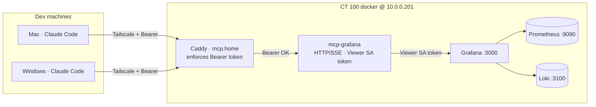

# TSD — Homelab MCP server (read-only observability gateway)

**Status:** ✅ accepted — scaffolding (2026-06-08)
**Goal:** One centrally-hosted MCP server on CT 100 that gives both dev machines (Mac + Windows desktop) a consistent, read-only tool surface over the homelab's existing telemetry — Prometheus metrics and Loki logs — so Claude Code can answer "what's going on with the lab" without bespoke per-machine setup.

> **Framing correction (from reading the code, not memory):** Claude is *not* a local model — Claude Code is a thin client to Anthropic's API, so there is nothing to self-host for inference. The win here is **one tool definition, shared by every dev machine**, not local compute. Windows has no WSL, which makes per-machine stdio installs fiddly — another reason to centralize.

## Current state (audited 2026-06-08)
The lab already exposes almost everything this MCP would surface, via two read APIs in [`docker/monitoring/`](../../docker/monitoring/docker-compose.yml):

- **Prometheus** (`:9090`, 30d retention) scrapes: `node-exporter` (host), `node-proxmox` (10.0.0.200), `cadvisor` (per-container CPU/mem/up), `pve-exporter` (Proxmox API), `postgres-exporter`, `blackbox-exporter` (endpoint uptime).
- **Loki** (`:3100`) holds **all** Docker container logs + host journal, shipped by `alloy`.

This is the key realization: **a read-only query gateway over Prometheus + Loki covers ~90% of the original scope** — container CPU/mem/up comes from cAdvisor, node/disk from node-exporter, uptime from blackbox, and *logs come from Loki* — so the server never needs the Docker socket.

## Why this matters
Without it, "check the lab from my laptop" means either SSH-ing in, opening `stats.home`, or hand-feeding Claude Code PromQL — and the experience differs per machine. An MCP server defines the access **once**: both dev machines point at the same Tailscale URL and get identical tools. It fits the existing pattern (one more Compose service next to the stack it reads).

## Approach
- **Run the official [`grafana/mcp-grafana`](https://github.com/grafana/mcp-grafana) — don't wrap community servers.** It queries **both** Prometheus *and* Loki through the Grafana datasources already wired up, plus alert-rule status — so one official, maintained process covers metrics, logs, *and* `active_alerts`. Chosen over two community servers (pab1it0 Prometheus + a separate Loki server) on every decision default: proven over new, simple over clever, points at the hub already running.
- **Read-only by construction — via a Viewer service account.** mcp-grafana authenticates to Grafana with a service-account token and exposes write-capable tools (dashboards, admin) unless trimmed. The robust guarantee is **not** trusting server flags — it's scoping the **service account to Viewer**, which *cannot* write regardless of which tools are exposed. No Docker socket, no Portainer, no `exec`. Blast radius of a compromise: "can read what `stats.home` already shows."
- **Slot into the existing networks.** Join `monitoring` (to reach `grafana:3000`) and `proxy` (so Caddy serves it). Add `mcp.home` to the [`Caddyfile`](../../docker/proxy/Caddyfile) + an AdGuard rewrite, matching the `.home` convention.
- **Dev machines stay thin clients** — each adds the same HTTP/SSE URL + bearer token to its Claude Code MCP config.

## Architecture

## Tools (tiered by risk — ship Phase 1)
All capabilities below are native to `mcp-grafana`, reached through the Grafana Prometheus/Loki datasources.

| Phase | Capability | Source (via Grafana) | Notes |
|-------|------------|----------------------|-------|
| **1** | PromQL instant query | Prometheus | |
| **1** | PromQL range query | Prometheus | Trends over time |
| **1** | metric / label discovery | Prometheus | What's scraped |
| **1** | datasource / target health | Prometheus | Scrape up/down |
| **1** | `container_status` | Prometheus (cAdvisor `up`/metrics) | Running/health per container — **no Docker socket** |
| **1** | `container_logs` | Loki (LogQL) | Read-only tail via the existing `alloy → loki` pipeline |
| **2** | `node_resources` | Prometheus (node-exporter) | CPU/mem/disk + **thin-pool usage** — relevant to the non-extendable thin-pool constraint |
| **2** | `active_alerts` | Grafana / datasource alert rules | Native to mcp-grafana — firing/normal status |
| **3** | `restart_container`, `recreate_stack`, `pull_images` | Docker / Portainer | **Recommend NOT building** — see below |

> `compose_config` was **dropped** (was Phase 2): the dev machine already has the homelab repo checked out, so resolved compose is available locally. The MCP server's value is **live runtime state the laptop can't see** — static config it already has.

**Stop at Phase 2.** Phase 3 turns a read-only observability gateway into a remote-control-your-homelab endpoint — a categorically different security posture, and outside what mcp-grafana does (it would need a separate Docker-touching server). Decision default: **diagnose from the dev machine, act with a deliberate SSH-in.** If ever built, gate every tool behind an explicit allowlist + confirmation, and revisit the auth model.

## Security model (three layers — deliberately NOT OAuth)
1. **Network boundary (primary): Tailscale.** Bind/serve only on the tailnet; never publish to the internet. This mirrors the whole existing proxy design — the [`Caddyfile`](../../docker/proxy/Caddyfile) already serves plain HTTP precisely because Tailscale (WireGuard) is the encryption + identity boundary. Tailscale authenticates device + user at the network layer.
2. **App layer (defense-in-depth): static bearer token, enforced at Caddy.** `Authorization: Bearer <token>` — mcp-grafana has no built-in endpoint auth (relies on transport security), so the token is checked at **Caddy**, which already fronts every `.home` service. Claude Code's MCP HTTP/SSE client supports custom headers, so the same token goes in both dev machines' config. Guards against any other device on the tailnet hitting the endpoint.
3. **Capability ceiling: Viewer service account.** Even past the network + bearer layers, the Grafana service-account token is **Viewer-scoped** — read-only by capability, not by configuration. This is the hard guarantee that the gateway can never mutate anything.

**Two secrets, split by location** (the powerful one never leaves CT 100):

| Secret | Path | Stored | Rotate |
|---|---|---|---|
| Grafana SA token (Viewer) | mcp-grafana → Grafana | CT 100 `.env` (gitignored) | Regenerate in Grafana UI |
| MCP bearer token | dev machine → endpoint | each dev machine's MCP config + CT 100 (Caddy) | Edit + restart Caddy |

**Rejected:**
- **OAuth 2.1** (the official MCP remote-auth spec) — built for multi-user / third-party clients. Standing up an auth server for one person violates simple-over-clever. Massive overkill.
- **mTLS** — secure, but client-cert renewal across Mac + Windows is ongoing pain for marginal gain over Tailscale + token.

**Upgrade trigger:** only if this ever goes multi-user or public-facing (it shouldn't, at Phase 1–2) does OAuth 2.1 earn its complexity.

## Cost & footprint
- One small container (a query proxy — tens of MB RAM). Negligible against current headroom. **~$0/mo**, no new hardware.
- Reuses Prometheus + Loki already running — no new data stores.

## Decisions log
- Scope: **read-only gateway over Prometheus + Loki**, not a Docker-touching server. Eliminates the socket mount entirely.
- **Server: official [`grafana/mcp-grafana`](https://github.com/grafana/mcp-grafana)** — one process covers Prometheus, Loki *and* alerts via existing datasources. Chosen over two community servers (proven, simple, points at the hub already running). *(resolved Q1+Q2, 2026-06-08)*
- Transport: **central HTTP/SSE on CT 100**, behind Caddy at `mcp.home`. Dev machines are thin clients.
- `container_logs` sourced from **Loki**; `container_status` from **cAdvisor via PromQL** — both socket-free, no Portainer. *(resolved Q3)*
- Auth: **Tailscale (network) + bearer token enforced at Caddy (app) + Viewer service account (capability ceiling)**. OAuth/mTLS rejected for a single-user lab. The Grafana SA token never leaves CT 100; dev machines hold only the Caddy bearer token. *(resolved Q4)*
- `compose_config` **dropped** — redundant with the repo already checked out on the dev machine. *(resolved Q5)*
- Phase 3 (mutating tools) is **out of scope** — diagnosis remote, action stays a deliberate SSH-in.

## Open questions
*(All five original questions resolved 2026-06-08 — see decisions log. Remaining items below surface during build.)*
- [ ] Confirm the running `grafana:latest` version satisfies mcp-grafana's datasource-query tool requirements (it tracks recent Grafana releases).
- [ ] Decide exactly which mcp-grafana tool categories to enable vs. disable — minimize surface even under the Viewer ceiling.
- [ ] Pick the Caddy mechanism for bearer enforcement on `mcp.home` (header matcher / `forward_auth`) and confirm it doesn't break MCP's SSE streaming.
