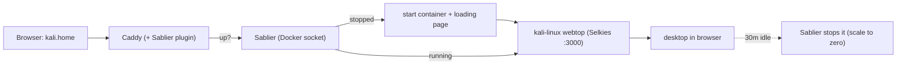

# TSD — On-demand browser desktops (webtop + Sablier)

**Status:** Approved
**Date:** 2026-06-07
**Author:** Anthony Brignano
**Supersedes:** the on-demand Kali *VM* proposal (chose containers for browser-on-demand UX)

## Context & goal

I want a **repeatable pattern** for desktop environments I can reach **from a
browser, on demand** — open `kali.home`, the desktop spins up, and it scales back
to zero when idle. First desktop is **Kali**; the pattern should make adding more
(Ubuntu, a dev desktop, etc.) trivial.

I considered a Proxmox **Kali VM** (full isolation, all tooling) but it can't
auto-start on a browser request and isn't a clean multi-desktop pattern.
**Containerized webtops + Sablier** give the exact "open a tab → it boots →
scale to zero" experience and are repeatable. **Trade-off:** containers share the
host kernel, so they're less isolated than a VM and a few low-level pentest tools
(raw kernel modules, wifi monitor mode, USB) may not work. Acceptable for everyday
use; if heavy pentesting needs full hardware access later, add a VM then.

## Architecture



## Components

| Component | Role | Where | RAM |
|---|---|---|---|
| **Caddy (custom build)** | Reverse proxy + Sablier middleware; serves `*.home` | `docker/proxy/` (rebuilt) | (existing) |
| **Sablier** | Starts containers on request, stops them when idle | `docker/desktops/` | ~30 MB (24/7) |
| **kali-linux webtop** | Browser-native Kali XFCE desktop (Selkies) | `docker/desktops/` | 0 idle, ~1.5 GB running |

New stack `docker/desktops/`; the proxy stack gains a Dockerfile + routes.

## Decisions

| Choice | Decision | Why |
|---|---|---|
| Desktop image | `lscr.io/linuxserver/kali-linux:latest` | Browser-native (Selkies :3000), maintained |
| On-demand engine | **Sablier** (`dynamic` strategy) | Start-on-visit with a themed loading page; scale-to-zero |
| Idle timeout | `session_duration 30m` | Auto-stop after 30 min of no traffic |
| Proxy | Caddy rebuilt with `sablier-caddy-plugin@v1.0.2` | Keep Caddy; add on-demand middleware |
| Hostname | `kali.home` → Caddy LXC (existing `*.home`) | Caddy proxies by Host header — no per-VM DNS needed |
| Auth | webtop `CUSTOM_USER` / `PASSWORD` (in `.env`) | Don't leave a root-capable desktop open on the tailnet |
| Exposure | Tailnet-only (Caddy :80) | Never public; no Cloudflare Tunnel |

## RAM impact

Always-on cost is just **Sablier (~30 MB)**. The Kali desktop uses **0 when
stopped** and ~1.5 GB only while you're actively in it — then Sablier scales it
back to zero. This is the most RAM-friendly possible shape and fits comfortably in
the ~11 GiB free (post-BIOS reclaim).

## Per-desktop sizing

Containers use only the RAM they actually touch (no VM-style pre-allocation or
ballooning), so right-sizing is just a per-service ceiling:

| Desktop | `mem_limit` | Notes |
|---|---|---|
| Kali (learning/simple pentest) | `4g` | Plenty for nmap/Metasploit/Burp; idle ~1–1.5 GB |
| Light desktop (Ubuntu XFCE) | `2g` | Basic browsing/dev |
| Heavy dev desktop | `6g` | IDEs, browsers, builds |

Add `cpus: "N"` similarly if a desktop should be capped on CPU (default: shares
all cores, fine for bursty interactive use). Each service sets its own limits.

## The repeatable pattern (add any desktop in ~6 lines)

To add e.g. an Ubuntu desktop later:
1. Add a service in `docker/desktops/docker-compose.yml` using
   `lscr.io/linuxserver/webtop:ubuntu-xfce`, with the same `sablier.enable=true` /
   `sablier.group=desktops` labels and a `_config` volume.
2. Add a Caddy site block for `ubuntu.home` (copy the `kali.home` block, swap the
   `reverse_proxy` target).
3. `docker compose up -d` + reload Caddy. Done — `ubuntu.home` is now on-demand.

## Implementation

### `docker/proxy/` — rebuild Caddy with the Sablier plugin

`docker/proxy/Dockerfile`:
```dockerfile
FROM caddy:2-builder AS builder
RUN xcaddy build --with github.com/sablierapp/sablier-caddy-plugin@v1.0.2
FROM caddy:2-alpine
COPY --from=builder /usr/bin/caddy /usr/bin/caddy
```

In `docker/proxy/docker-compose.yml`, change the caddy service from
`image: caddy:2-alpine` to `build: .` (keep everything else).

Add to `docker/proxy/Caddyfile`:
```caddy
# kali.home -> Kali webtop, started on-demand by Sablier, scaled to zero when idle
http://kali.home {
	sablier http://sablier:10000 {
		group desktops
		session_duration 30m
		dynamic {
			display_name "Kali Desktop"
			theme hacker-terminal
		}
	}
	reverse_proxy kali-linux:3000
}
```

### `docker/desktops/` — Sablier + the Kali webtop

`docker/desktops/docker-compose.yml`:
```yaml
services:
  sablier:
    image: sablierapp/sablier:1.8.1
    container_name: sablier
    command: ["start", "--provider.name=docker"]
    volumes:
      - /var/run/docker.sock:/var/run/docker.sock:ro
    restart: unless-stopped
    networks: [proxy]

  kali-linux:
    image: lscr.io/linuxserver/kali-linux:latest
    container_name: kali-linux
    environment:
      PUID: 1000
      PGID: 1000
      TZ: ${TZ:-America/New_York}
      CUSTOM_USER: ${DESKTOP_USER:?required}
      PASSWORD: ${DESKTOP_PASSWORD:?required}
    volumes:
      - kali_config:/config
    shm_size: "1gb"
    mem_limit: 4g          # safety ceiling; container only uses what it touches
    security_opt:
      - seccomp:unconfined
    labels:
      - sablier.enable=true
      - sablier.group=desktops
    networks: [proxy]
    # No restart policy — Sablier owns this container's lifecycle.

volumes:
  kali_config:

networks:
  proxy:
    external: true
    name: proxy_proxy
```

`docker/desktops/.env.example`:
```
TZ=America/New_York
DESKTOP_USER=admin
DESKTOP_PASSWORD=changeme
```

### Deploy order
1. `docker/desktops/`: `cp .env.example .env`, set credentials, `docker compose up -d`.
2. `docker/proxy/`: `docker compose up -d --build` (rebuilds Caddy with the plugin and loads the `kali.home` route).
3. Ensure `kali.home` resolves to the Caddy LXC (`10.0.0.201`) — covered by the
   existing `*.home` rewrite, or add a specific AdGuard rewrite.

## Security

- **Set `DESKTOP_USER`/`DESKTOP_PASSWORD`** — otherwise anyone on the tailnet gets
  a root-capable Kali desktop.
- Tailnet-only (Caddy :80, LAN/tailnet). **Never** add to the Cloudflare Tunnel.
- `seccomp:unconfined` + `cap_add: NET_ADMIN, NET_RAW` (so nmap and other
  raw-socket tools can exec — their binaries carry file-caps the default bounding
  set rejects) + shared kernel = **weaker isolation than a VM**. `NET_ADMIN` in
  particular widens the container-escape surface. Unlike a VM (own kernel, hyper-
  visor boundary), a container shares the **host kernel**, so a kernel bug here
  could be leveraged to escape — and this runs inside the *privileged* Docker LXC,
  a softer boundary still.
- **Acceptable because:** tailnet-only, single-user, and we control what runs in
  it. **The line:** scanning/learning/known tools = fine; **detonating untrusted
  or malicious code (malware analysis, sketchy exploits) belongs in a disposable
  VM with snapshots, not here.** That's the trigger to add the Kali *VM*.
- Sablier mounts the Docker socket **read-only** but can start/stop containers —
  it's effectively privileged; keep it internal.

## HTTPS note (resolved — HTTPS required)

**Outcome: `kali.home` is served over HTTPS.** We intended HTTP (Tailscale already
encrypts), but the Selkies desktop **hard-refuses to run without a secure context**
— plain HTTP shows "This application requires a secure connection (HTTPS)" and a
black screen, not just degraded clipboard. So HTTP was not an option for this image.

Implemented: Caddy global `auto_https disable_redirects` (keeps the other `*.home`
sites on HTTP without forced redirects, while allowing cert management), a
`https://kali.home` block with **`tls internal`** (Caddy's local CA), an
`http://kali.home → https` redirect, and `:443` published on the caddy container.

First visit shows a browser cert warning (local CA untrusted); proceed through it
(still a valid secure context, so Selkies works) or install Caddy's root CA on each
device to remove it: `docker exec caddy cat /data/caddy/pki/authorities/local/root.crt`
→ trust in the OS keychain (macOS: System keychain → Always Trust; iOS: install
profile + enable in Certificate Trust Settings).

## Verify

- Visit `http://kali.home` with the container stopped → Sablier loading page →
  desktop appears within ~10–20 s.
- Log in with `DESKTOP_USER` / `DESKTOP_PASSWORD`.
- Leave it 30 min idle → `docker ps` shows `kali-linux` stopped (scaled to zero);
  Capacity dashboard "RAM free" returns to baseline.
- Re-visiting `kali.home` boots it again on demand.

## Rollback

```bash
cd docker/desktops && docker compose down
# revert proxy/ Caddy to image: caddy:2-alpine and remove the kali.home block
```

## Notes / cleanup

- **Remove the abandoned Kali VM image** on m5:
  `rm -f /var/lib/vz/template/kali-linux-*-qemu-amd64.7z` and the extracted `.qcow2`.
- Guacamole is **not needed** — webtops are browser-native.
- Future desktops (Ubuntu/dev) follow the repeatable pattern above.
- If heavy pentesting later needs full hardware/kernel access, add a Kali *VM*
  alongside (the earlier VM TSD approach) for that specific use.
